# Aplicação Azure: Language & Speech

Atividade referente ao Lab do módulo: [Seus Primeiros Passos com IA](https://web.dio.me/project/analise-de-sentimentos-com-language-studio-no-azure-ai/learning/8c520fa1-cfbc-4214-b155-f98a36f49f51?back=/track/randstad-analise-de-dados&tab=undefined&moduleId=undefined). 

## Language: Analisando uma grande quantidade de comentários
1. Com uma assinatura ativa, é necessário ativar o recurso que vamos utilizar no Azure. No nosso caso será a **Microsoft.CognitiveServices**.
---
2. Primeiro, no [Portal da Azure](https://portal.azure.com/) é necessário encontrar a assinatura que vamos trabalhar, na barra de pesquisa basta digitar *'Subscription'*:  
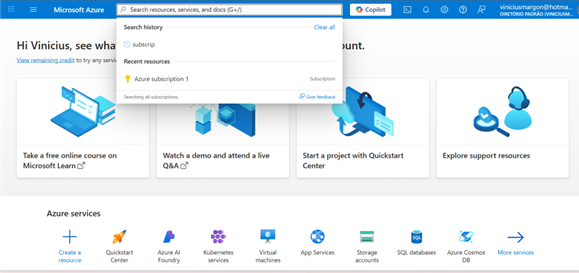  
---
3. Dentro da assinatura, na barra lateral esquerda, encontrar *'Resource providers'*, procurar o Provedor que vamos utilizar (**Microsoft.CognitiveServices**) e apertar em *Registrar* para poder utilizar o recurso.  
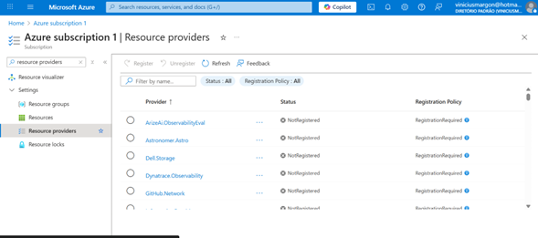 
---
4. Primeiro passo é criar o recurso, pela barra lateral esquerda, selecionar *Language Service*, completar as informações e **criar**. 
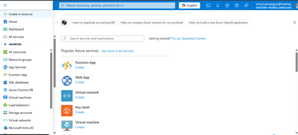 
---
5. Conferindo quais recursos foram criados ou estão ativos:  
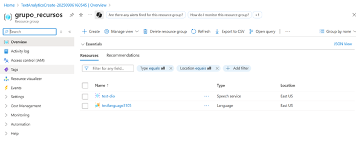 
---
6. Agora é necessário entrar no portal da funcionalidade que vamos utilizar, nesse primeiro caso o [Portal Language](https://language.cognitive.azure.com/home).
---
7. Agora linkando o portal com o Azure e escolhendo a opção para trabalhar, para analisar comentários vamos em *Análise de sentimentos*:  
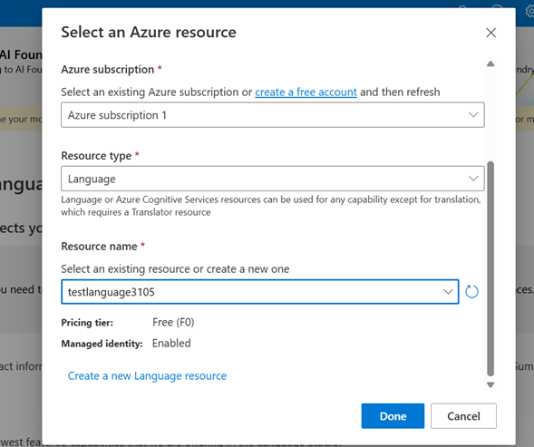 
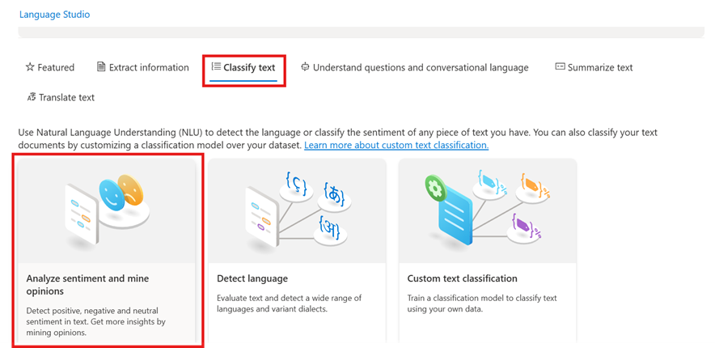 
---
8. Aqui quando entramos com um texto:  
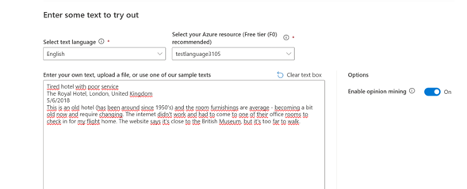 
Recebemos uma análise:  
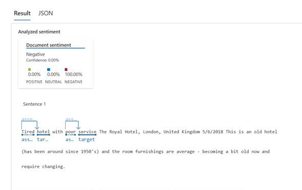 
---
9. Para automatizar, utilizar o campo abaixo:  
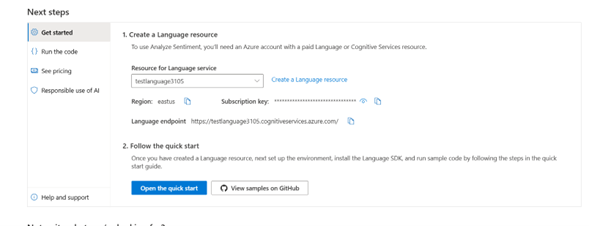 
Algumas maneiras de trabalhar aqui encontramos no [GitHub - Análise de sentimentos](https://aka.ms/analyze-sentiment-samples).

## Speech: Transformando fala em texto em tempo real (facilitar análises de recados falados)

Passos de 1 a 5 continuam os mesmos, então seguindo:

6. Entrar no [Portal da Funcionalidade Speech](speech.microsoft.com)
---
7. Nas configurações, conferir se existe recurso criado para a funcionalidade, caso não tenha criar e selecionar:  
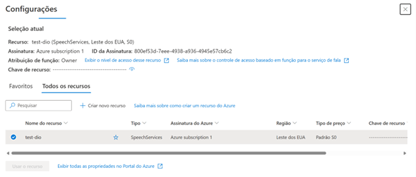 
---
8. Aqui podemos inputar audios, no idioma indicado e ter uma análise, como no language:  
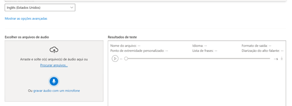 
--- 
9. Abaixo vemos o campo para automatizar:  
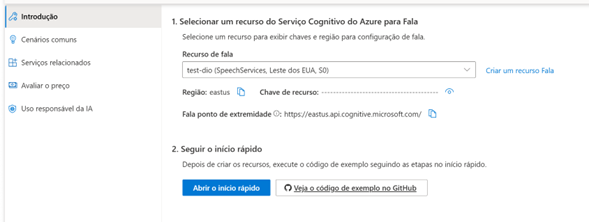 
Também temos maneiras de fazer isso no [GitHub - Transformar fala em texto](https://github.com/Azure-Samples/cognitive-services-speech-sdk)